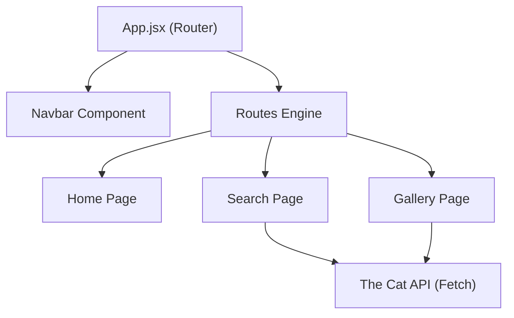
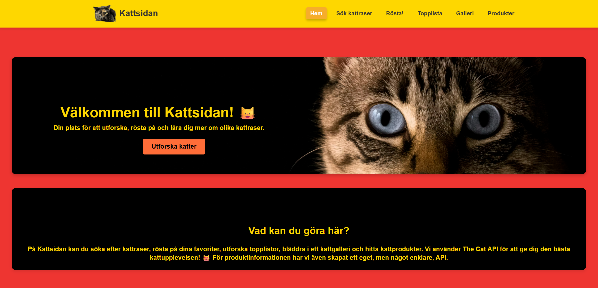
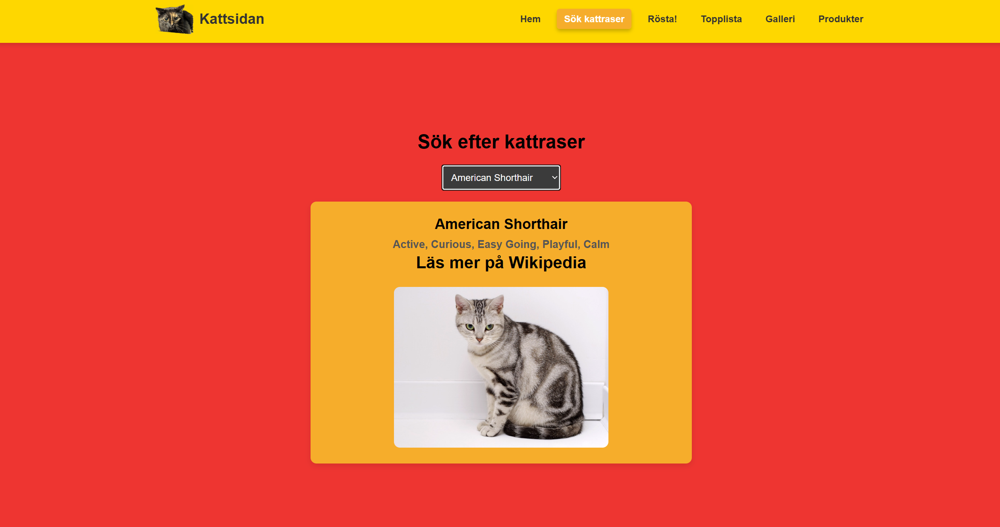
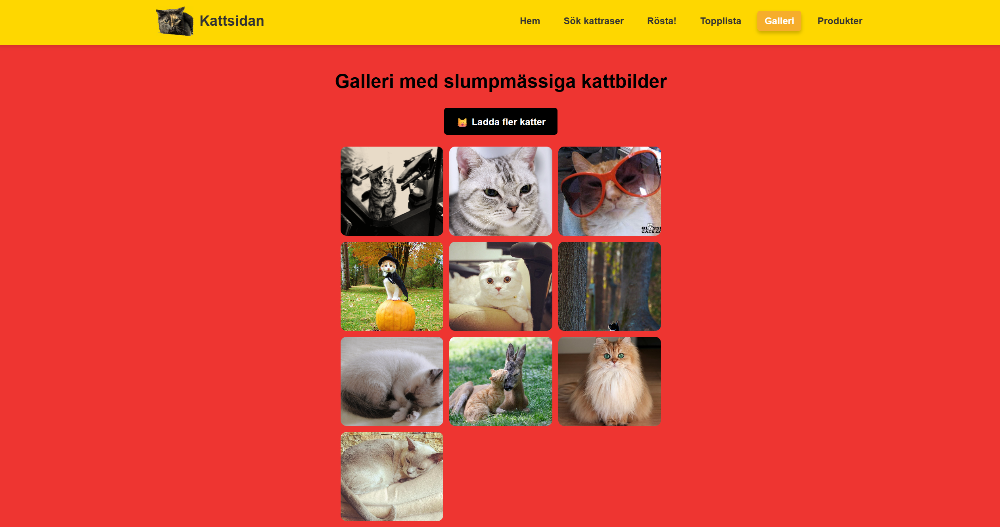

# 🐱 Kattsidan (React Project)

[](https://react.dev/)
[](https://vitejs.dev/)
[](https://reactrouter.com/)
[](https://thecatapi.com/)

En modern och responsiv webbapplikation byggd i **React 19** och **Vite** som låter användare utforska kattraser, se slumpmässiga bilder och lära sig mer om sina favoritdjur.  
Fokus: **Asynkron datahämtning**, **Komponentbaserad arkitektur**, **Dynamisk Routing**, **State Management**.

---

## Innehåll
- [Projektstruktur](#-projektstruktur)
- [Mappstruktur](#-mappstruktur)
- [Kom igång (Build & Run)](#-kom-igång-build--run)
  - [Förutsättningar](#förutsättningar)
  - [Installera och kör](#installera-och-kör)
- [Funktioner](#-funktioner)
- [Arkitektur](#-arkitektur)
- [Tekniska koncept som används](#-tekniska-koncept-som-används)
- [API-integration](#-api-integration)
- [Katalog över viktiga filer](#-katalog-över-viktiga-filer)

---

## 📁 Projektstruktur

Lösningen är uppdelad i tydliga moduler för att främja Separation of Concerns:

| Projektdel | Typ | Syfte |
|:---|:---|:---|
| `src/pages/` | Vyer | Innehåller huvudundersidorna (Home, Search, Gallery, etc.). |
| `src/components/` | Komponenter | Återanvändbara UI-delar som navigationsmenyn. |
| `src/css/` | Styling | Separat CSS-hantering för varje sida och komponent för modulär design. |
| `public/` | Assets | Statiska filer som logotyper och bilder som används i applikationen. |

---

## 🧱 Mappstruktur

```text
ReactProjektKatt/
├─ src/
│  ├─ components/
│  │  └─ Navbar.jsx            # Global navigering
│  ├─ pages/
│  │  ├─ Home.jsx              # Landningssida med hero-sektion
│  │  ├─ Search.jsx            # Sökfunktion för raser via The Cat API
│  │  ├─ Gallery.jsx           # Slumpmässigt bildgalleri med live-laddning
│  │  ├─ Vote.jsx              # Röstningsfunktion (Interaktion med API)
│  │  ├─ TopList.jsx           # Visning av populära raser
│  │  └─ Products.jsx          # Visning av kattprodukter via eget API
│  ├─ css/                     # Modulär styling (Home.css, Search.css, etc.)
│  ├─ App.jsx                  # Router-konfiguration och layout
│  └─ main.jsx                 # Entrypoint för React-applikationen
├─ public/                     # Statiska bilder (Logo, HeroHeader)
├─ package.json                # Beroenden (React 19, Router v7) och skript
└─ vite.config.js              # Konfiguration för Vite-byggverktyget

```

---

## 🚀 Kom igång (Build & Run)

### Förutsättningar
- **Node.js** (senaste LTS-versionen rekommenderas)
- **npm** (följer med Node.js)

### Installera och kör
1. Klona arkivet till din lokala maskin.
2. Öppna terminalen i projektmappen och installera beroenden:
   `npm install`
3. Starta utvecklingsservern:
   `npm run dev`
4. Öppna webbläsaren på den adress som visas i terminalen (standard är `http://localhost:5173`).

---

## ⚙️ Funktioner

- **Rassökning** – Dynamisk hämtning av kattraser med automatisk filtrering för att endast visa kompletta profiler med bilder.
- **Live Galleri** – Slumpmässigt genererade bilder med en "Ladda fler"-funktion som triggar nya asynkrona anrop.
- **SPA-navigering** – Sömlös växling mellan sex olika vyer utan omladdning av sidan via React Router v7.
- **Rasinformation** – Detaljerad vy över temperament och direkta Wikipedia-länkar för fördjupad läsning.
- **Produktintegration** – En dedikerad sektion för kattillbehör som konsumerar ett sekundärt API.

---

## 🧱 Arkitektur



---

- **Single Page Application (SPA):** Använder klientbaserad routing för en snabb användarupplevelse.
- **Komponentbaserad:** Vyer är uppbyggda av mindre, hanterbara komponenter för bättre skalbarhet.

---

## 🧩 Tekniska koncept som används

| Område | Implementation | Förklaring |
|:---|:---|:---|
| **State Management** | `useState` | Hanterar dynamiskt tillstånd för API-data, valda kattraser och omrenderingar. |
| **Lifecycle Hooks** | `useEffect` | Hanterar sidoeffekter såsom initial datahämtning vid komponentladdning. |
| **Asynkron Fetch** | `fetch().then()` | Utför HTTP-anrop till externa REST API:er med JSON-hantering och felmeddelanden. |
| **List Rendering** | `.map()` | Renderar effektivt listor av raser och bildgallerier baserat på dynamiska arrayer. |

---

## 📡 API-integration

Projektet integrerar primärt med **The Cat API** för att leverera realtidsdata:
- **Autentisering:** Använder API-nycklar via request headers (`x-api-key`) för att få åtkomst till fullständiga raslistor.
- **Sanering av data:** Inkluderar logik för att validera inkommande objekt (t.ex. kontroll av bild-URL:er) innan de sparas i appens state.

---

## 🖼️ Skärmbilder

- **ReactProjekt – Startsida**  
  

- **ReactProjekt – Sökfunktion**  
  

- **ReactProjekt – Galleri**  
  

---

## 📚 Katalog över viktiga filer

<details>
<summary><strong>Kärnfiler & Konfiguration</strong></summary>

- `App.jsx` – Hanterar hela applikationens routing och huvudlayout.
- `package.json` – Definierar beroenden såsom React 19 och React Router 7.
- `vite.config.js` – Konfigurerar byggprocessen för Vite-miljön.
</details>

<details>
<summary><strong>Vyer & Logik</strong></summary>

- `Search.jsx` – Central komponent för asynkron hämtning och filtrering av kattraser.
- `Gallery.jsx` – Implementerar logik för slumpmässiga bildflöden och manuell uppdatering av state.
- `Navbar.jsx` – Hanterar navigeringslänkar och globalt UI.
</details>

---

## 👥 Projektgrupp & Kontext

Detta projekt utvecklades som en del av kursen:

**Systemarkitektur och systemintegration (15 hp)**  
(*System Architecture and System Integration, 15 credits*)

Projektet genomfördes i en grupp där vi utvecklade en webbaserad klientapplikation som en del av en större systemlösning baserad på tjänsteorienterad arkitektur (SOA).

### 🎯 Fokus i projektet

Arbetet inkluderade:

- Integration med externa och interna API:er (t.ex. The Cat API och eget backend-API)  
- Utveckling av en klientapplikation i React som konsumerar webbtjänster  
- Hantering av asynkron data och dynamiska användargränssnitt  
- Design av komponentbaserad arkitektur med fokus på löst kopplade system  
- Implementation av routing och state management i en SPA  

### 🧠 Lärandeperspektiv

Projektet gav praktisk erfarenhet inom:

- Systemintegration mellan frontend och backend  
- Tjänsteorienterad arkitektur (SOA)  
- API-design och konsumtion av REST-tjänster  
- Hur moderna webbapplikationer samverkar i distribuerade system  

## AI-ASSISTANS OCH KODGENERERING

Delar av denna kodbas har skapats, refaktorerats eller assisterats med hjälp av stora språkmodeller (LLM) och AI-verktyg för att effektivisera utvecklingsprocessen och förbättra kodkvaliteten.

### Verktyg som använts
- **ChatGPT** (för utformning av arkitektur och dokumentation).
- **Gemini** (för felsökning av router-logik och konvertering av komponenter).

### Omfattning av AI-assistans
AI har huvudsakligen använts för:
1. **Boilerplate-kod:** Generering av standardstruktur för sidor och CSS-filer.
2. **API-logik:** Strukturering av asynkrona anrop baserat på The Cat API:s dokumentation.
3. **Dokumentation:** Förbättring av kommentarer och generering av denna README-fil.

### Mänsklig granskning
All AI-genererad kod har granskats, testats och validerats manuellt av en mänsklig utvecklare för att säkerställa funktionalitet.
